# Caption Compass Gate Visual Maps

## Purpose

This document maps the Caption Compass gate system visually. It is a planning and orientation document for judges, maintainers, and implementation agents.

It does not claim that app behavior is implemented unless `README.md` says it is implemented. The current public README remains the source of truth for project status, working commands, and known limitations.

## Whole-System Spine

Caption Compass is designed as a gate sequence. Each gate produces or preserves an artifact that later gates depend on.

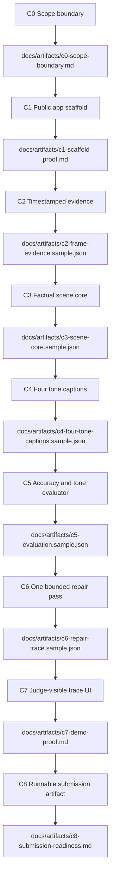

## Judge-Backwards Design Map

The gate system is designed backwards from Track 2 judging: factual accuracy and tone match across four required styles.

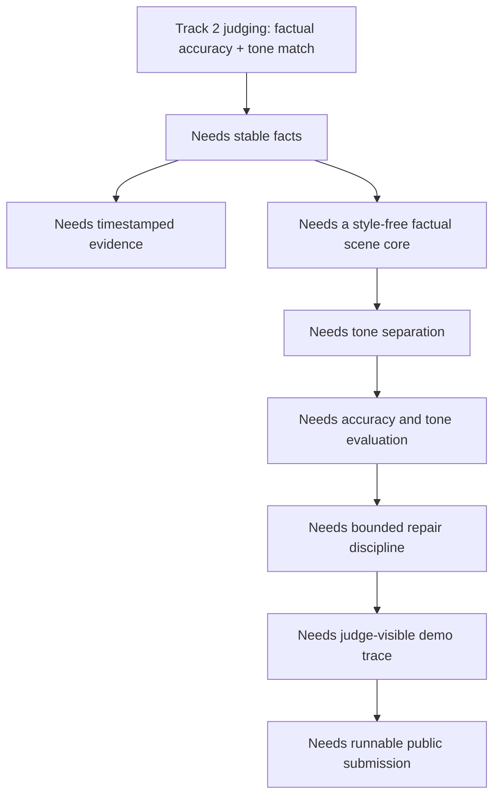

| Judging need | Gate response |
| --- | --- |
| Factual accuracy | C2 timestamped evidence and C3 factual scene core |
| Tone match | C4 explicit tone rubrics |
| Consistency across styles | One `scene_core_id` flows through C3-C6 |
| LLM-judge readability | C4 short captions, C5 issue taxonomy, C7 trace UI |
| Runnable submission | C8 Docker/readiness artifact |

## Gate-by-Gate Visual Cards

## C0 - Scope Boundary

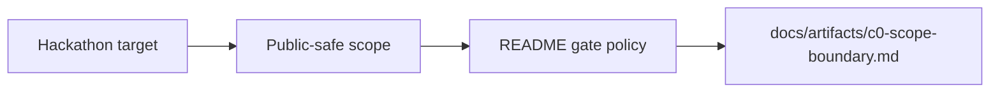

| Field | Value |
| --- | --- |
| Why | Lock scope, IP boundary, and judging target before app work. |
| Input | Current README, gate policy, and Track 2 requirements. |
| Output | Public-safe scope and README discipline. |
| Artifact | `docs/artifacts/c0-scope-boundary.md` |
| Stop rule | Stop if scope expands into app implementation or private material. |
| Judge impact | Shows the project is honest and intentionally scoped. |

## C1 - Public App Scaffold

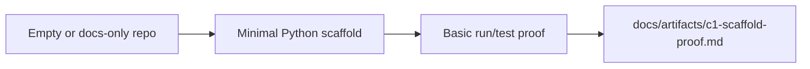

| Field | Value |
| --- | --- |
| Why | Establish a minimal runnable structure before feature work. |
| Input | C0 scope and README policy. |
| Output | Small app scaffold, basic tests or verification. |
| Artifact | `docs/artifacts/c1-scaffold-proof.md` |
| Stop rule | Stop if provider, video, captions, or UI behavior starts early. |
| Judge impact | Makes the repo executable without overclaiming features. |

## C2 - Timestamped Evidence

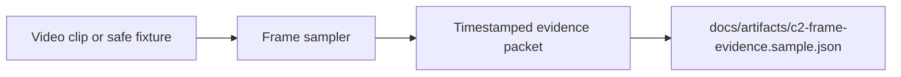

| Field | Value |
| --- | --- |
| Why | Anchor later facts to visible evidence. |
| Input | Short video clip or safe fixture. |
| Output | Frame IDs, timestamps, safe image refs, extraction warnings. |
| Artifact | `docs/artifacts/c2-frame-evidence.sample.json` |
| Stop rule | Stop if output leaks local paths or starts scene reasoning. |
| Judge impact | Improves factual accuracy and traceability. |

## C3 - Factual Scene Core

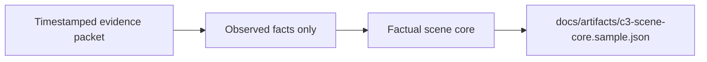

| Field | Value |
| --- | --- |
| Why | Separate visible facts from style, jokes, and unsupported inference. |
| Input | C2 frame evidence. |
| Output | `scene_core_id`, observed entities/actions, uncertainties, unsupported inferences. |
| Artifact | `docs/artifacts/c3-scene-core.sample.json` |
| Stop rule | Stop if tone, humor, emotion inference, or unsupported causality enters the core. |
| Judge impact | Gives all four captions the same factual basis. |

## C4 - Four Tone Captions

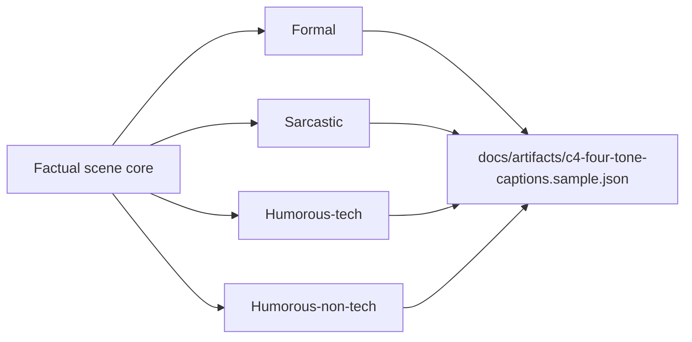

| Field | Value |
| --- | --- |
| Why | Render the same facts in the four required Track 2 styles. |
| Input | C3 factual scene core. |
| Output | Four captions with stable `scene_core_id`. |
| Artifact | `docs/artifacts/c4-four-tone-captions.sample.json` |
| Stop rule | Stop if tone rendering changes the factual claim set. |
| Judge impact | Directly targets tone match while preserving accuracy. |

## C5 - Accuracy and Tone Evaluator

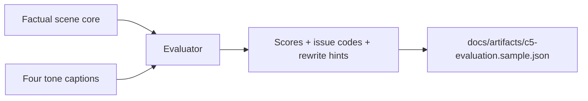

| Field | Value |
| --- | --- |
| Why | Make judge-like quality checks visible and structured. |
| Input | C3 factual core and C4 captions. |
| Output | Accuracy, tone, clarity scores, issue codes, repair eligibility. |
| Artifact | `docs/artifacts/c5-evaluation.sample.json` |
| Stop rule | Stop if evaluator claims proof or starts repairing captions. |
| Judge impact | Shows how the system catches factual and tone failures. |

## C6 - Bounded Repair

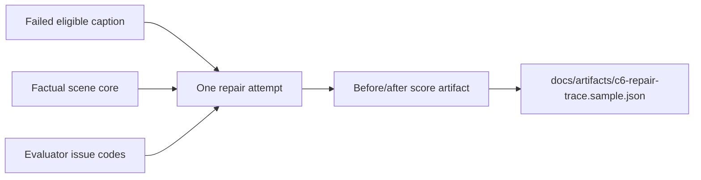

| Field | Value |
| --- | --- |
| Why | Improve failed captions without creating an unbounded agent loop. |
| Input | C5 evaluation, C4 captions, C3 factual core. |
| Output | One repair pass, before/after scores, accepted/rejected status. |
| Artifact | `docs/artifacts/c6-repair-trace.sample.json` |
| Stop rule | Stop if repair loops more than once or mutates the factual core. |
| Judge impact | Demonstrates disciplined quality improvement. |

## C7 - Judge-Visible Trace UI

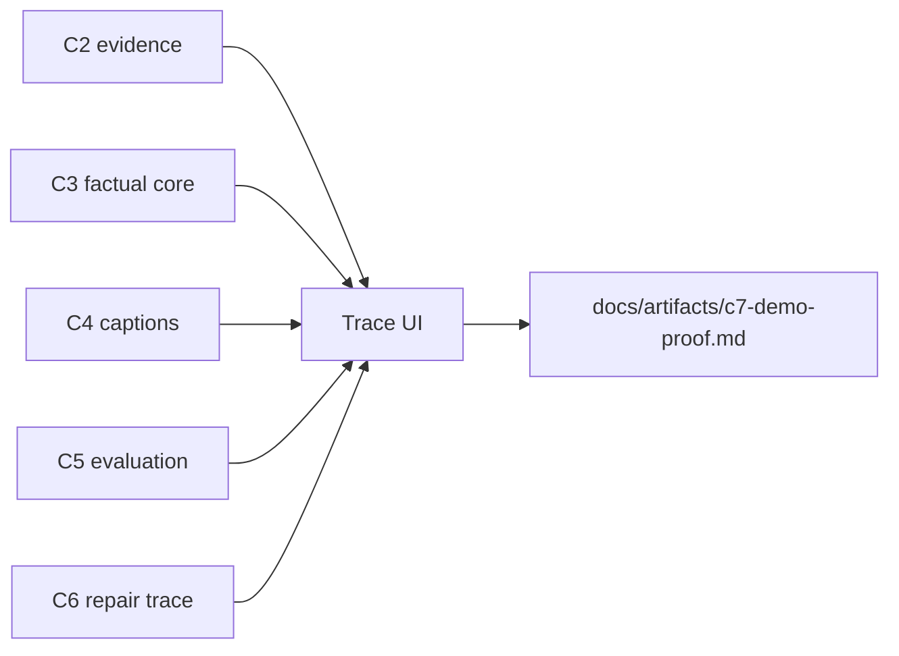

| Field | Value |
| --- | --- |
| Why | Show the full quality path in a demo a judge can inspect quickly. |
| Input | C2-C6 outputs or safe sample artifacts. |
| Output | Thin UI with evidence, core, captions, scores, repair state. |
| Artifact | `docs/artifacts/c7-demo-proof.md` |
| Stop rule | Stop if UI hides the trace or crosses into Docker/submission work. |
| Judge impact | Makes Caption Compass visibly more than a prompt wrapper. |

## C8 - Runnable Submission Artifact

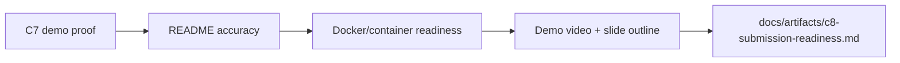

| Field | Value |
| --- | --- |
| Why | Package the project for a public hackathon submission. |
| Input | C7 proof, current README, tests, Docker status. |
| Output | Runnable instructions, readiness checklist, demo materials. |
| Artifact | `docs/artifacts/c8-submission-readiness.md` |
| Stop rule | Stop if README or submission docs claim unverified behavior. |
| Judge impact | Makes the project cloneable, runnable, and easy to evaluate. |

## Artifact Chain Map

`docs/artifacts/` is the project evidence trail. Each gate should leave behind a small public-safe proof of what changed.

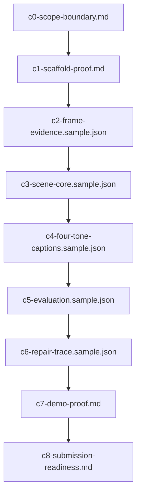

| Artifact | What it proves |
| --- | --- |
| `docs/artifacts/c0-scope-boundary.md` | Scope and public-safe boundary are explicit. |
| `docs/artifacts/c1-scaffold-proof.md` | The repo has a minimal runnable/testable structure. |
| `docs/artifacts/c2-frame-evidence.sample.json` | Video evidence can be sampled into timestamped anchors. |
| `docs/artifacts/c3-scene-core.sample.json` | Observed facts can be separated from unsupported inference. |
| `docs/artifacts/c4-four-tone-captions.sample.json` | One factual core can produce four required styles. |
| `docs/artifacts/c5-evaluation.sample.json` | Captions can be scored for accuracy, tone, and clarity. |
| `docs/artifacts/c6-repair-trace.sample.json` | Failed eligible captions can be repaired once and re-scored. |
| `docs/artifacts/c7-demo-proof.md` | The UI can expose the trace to a judge. |
| `docs/artifacts/c8-submission-readiness.md` | The repo is ready or blockers are documented honestly. |

## Data Contract Transformation Map

Each transformation should preserve public-safe boundaries and avoid unsupported claims.

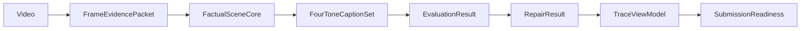

| Contract | Boundary rule |
| --- | --- |
| `FrameEvidencePacket` | Evidence only; no scene reasoning. |
| `FactualSceneCore` | Observed facts, uncertainty, and unsupported inferences only. |
| `FourToneCaptionSet` | Style changes presentation, not facts. |
| `EvaluationResult` | Scores and issue codes; no repair. |
| `RepairResult` | One repair pass; no new facts or repeated loops. |
| `TraceViewModel` | Display existing outputs; do not invent behavior. |
| `SubmissionReadiness` | Document verified commands and honest blockers. |

## README Sync Map

README must lag implementation, never lead it.

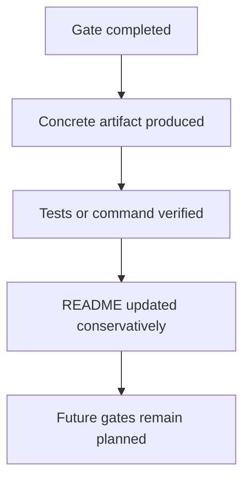

README updates must describe only actual completed behavior. If a gate artifact or command is missing, README must not mark that gate complete.

## Public-Safe Boundary Map

| Allowed | Not allowed |
| --- | --- |
| Public repo docs | Private references |
| Generated public-safe artifacts | Local-only private paths |
| Public-safe prompt contracts | Secrets or API keys |
| Sample fixtures | Source-book quotes |
| README gate status | Unpublished architecture |
| Verified commands | Long-term product strategy |
| Known limitations | Claims that future gates are implemented |

## Minimal Judge Demo Path

This is the intended 60-second judge path once C7/C8 are actually implemented.

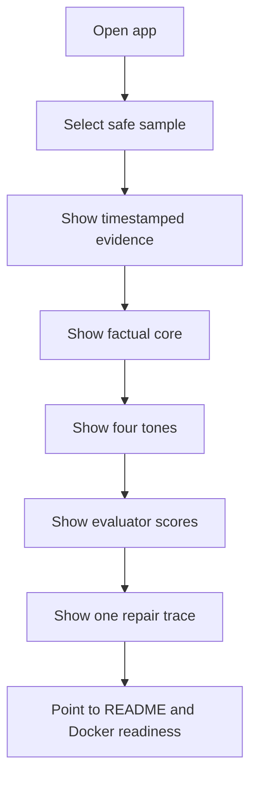

C8 readiness is only claimed when C8 is implemented, verified, and reflected honestly in `README.md`.
